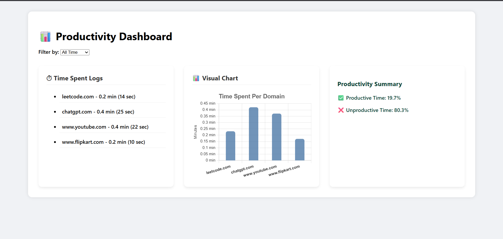

# ⏱️ Productivity Tracker Chrome Extension

A smart and simple Chrome extension to **track how much time you spend** on different websites and provide insightful **productivity analytics** in a visually engaging dashboard.

---

## 📸 Dashboard Preview

---

## 🚀 Features

- 🔄 Tracks time spent on each domain
- 📅 Shows data for *today* or *all-time*
- 📊 Dynamic dashboard with animated graphs
- ✅ Calculates **productive vs unproductive** time
- ⚡ Blinking glassmorphism-style UI cards
- 🧠 Designed to help you **analyze your browsing behavior**

---

## 📁 File Structure

chrome-extension-productivity/
├── background.js
├── content.js
├── dashboard-preview.png
├── dashboard.css
├── dashboard.js
├── icon.png
├── index.html
├── manifest.json
├── popup.html
├── popup.js
├── script.js
├── style.css
└── README.md

yaml
Copy
Edit

---

## 🧪 How to Use

1. **Clone this repository** to your machine
2. Open Chrome and go to `chrome://extensions/`
3. Enable ✅ Developer Mode
4. Click **"Load Unpacked"** and select this project folder
5. The extension will start tracking your site usage
6. Open `index.html` in browser to view your dashboard (`Ctrl+O` > select `index.html`)

---

## 📊 Dashboard Sections

- `⏱️ Time Spent Logs`: lists domains and durations
- `📊 Visual Chart`: a dynamic bar chart of site usage
- `✅ Productivity Summary`: percentage of productive time

---

## 🛡 License

Licensed under the [MIT License](LICENSE).  
You are free to use, modify, and distribute this project.

---

## 👨‍💻 Author

**Sachin Kumar**  
_“I believe good work shouldn't scream — it should resonate.”_
